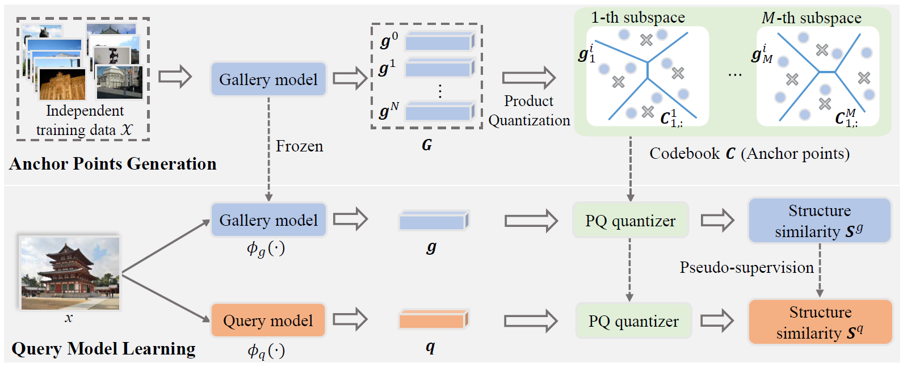

**SSP**: **S**tructure **S**imilarity **P**reservation Learning for Asymmetric Image Retrieval
========
PyTorch training code for **C**ontextual **S**imilarity **D**istillation for Asymmetric Image Retrieval. We propose a flexible contextual similarity distillation framework to enhance the small query model and keep its output feature compatible with that of the large gallery model, which is crucial with *asymmetric retrieval*. Inference in 50 lines of PyTorch.



**What it is**. A well trained gallery model $\phi_g(\cdot)$ is first applied to extract the image features $\left[\bm{g}^1,\bm{g}^2,\cdots,\bm{g}^N\right]$ of the training data $\mathcal{X}$. Then, these features are utilized to train a product quantizer, whose codebook $\bm{C}$ serves as the anchor points in the embedding space of $\phi_g(\cdot)$. During query model learning, an image $x$ of training dataset $\mathcal{T}$ is mapped into two feature vectors $\bm{g}$ and $\bm{q}$ by the query and gallery models, respectively. Then, the similarities between the query/gallery feature $(\bm{q}/\bm{g})$ and the anchor points are regarded as structure similarities $(\bm{S}^q/\bm{S}^g)$. Finally, we constrain the consistency between structure similarities $\bm{S}^q$ and $\bm{S}^g$ to optimize the query model. This ensures the embedding spaces of query and gallery models are well aligned, which is essential for *asymmetric retrieval*.

**About the code**. 
**SSP** is very simple to implement and experiment with.
Training code follows this idea - it is not a library,
but simply a [Ours_training.py](Ours_training.py) importing model and criterion
definitions with standard training loops.


# Requirements
- Python 3
- [PyTorch](https://pytorch.org/get-started/locally/) tested on 1.7.1+, torchvision 0.8.2+
- numpy
- matplotlib
- timm==0.4.12
- faiss>=1.6.3


# Usage - Representation learning
There are no extra compiled components in **SSP** and package dependencies are minimal,
so the code is very simple to use. We provide instructions how to install dependencies via conda.
Install PyTorch 1.7.1+ and torchvision 0.8.2+:
```
conda install -c pytorch pytorch torchvision
```

## Data preparation
Before going further, please check out [Filip Radenovic's great repository on image retrieval](https://github.com/filipradenovic/cnnimageretrieval-pytorch). We use his code and model to extract features for training images. If you use this code in your research, please also cite their work! [link to license](https://github.com/filipradenovic/cnnimageretrieval-pytorch/blob/master/LICENSE)

You should also checkout [Google landmarkv2 github](https://github.com/cvdfoundation/google-landmark) and [*SfM120k* website](http://cmp.felk.cvut.cz/cnnimageretrieval/). We use their training images. If you use these images in your research, please also cite their work!

Download and extract *SfM120k* train and val images with annotations from http://cmp.felk.cvut.cz/cnnimageretrieval/.

Download and extract Google landmarkv2 train and val images with annotations from
[https://github.com/cvdfoundation/google-landmark](https://github.com/cvdfoundation/google-landmark).

Download [ROxf](http://www.robots.ox.ac.uk/~vgg/data/oxbuildings) and [RPar](http://www.robots.ox.ac.uk/~vgg/data/parisbuildings) datastes with [annotations](http://cmp.felk.cvut.cz/revisitop/).
We expect the directory structure to be the following:
```
/data/
  ├─ R101-DELG.pth # large gallery model
  ├─ oldclassifier.pkl # classifier from large gallery model
  ├─ train # training datasets
  |    ├─ GLDv2
  |    |   ├─ train.csv
  |    |   ├─ GLDv2_Triplet.pkl
  |    |   ├─ train_clean.csv
  |    |   ├─ GLDv2-clean-train-split.pkl
  |    |   ├─ GLDv2-clean-val-split.pkl
  |    |   └─ train
  |    └─ retrieval-SfM-120k
  |         ├─ ims
  |         └─ retrieval-SfM-120k.pkl
  ├─ PQ_centroids # anchor points
  |    ├─ R1M_DELG-R101-Paris-M-PQ_32_256_centroids.pkl
  |    ├─ R1M_DELG-R101-Paris-M-PQ_16_256_centroids.pkl
  |    ├─ R1M_GeM-R101-PQ_32_256_centroids.pkl
  |    └─ R1M_GeM-R101-PQ_32_256_centroids.pkl
  ├─ train_features # training features
  |    ├─ SFM_R101_DELG.pkl
  |    ├─ GLDv2_R101_DELG.pkl
  |    ├─ R1M_R101_DELG.pkl
  |    ├─ R1M_R101_GeM.pkl
  |    ├─ SFM_R101_GeM.pkl
  |    └─ GLDv2_R101_GeM.pkl
  ├─ test_features # testing features
  |    ├─ R101-DELG-rparis6k.pkl
  |    ├─ R101-DELG-roxford5k.pkl
  |    ├─ R101-GeM-rparis6k.pkl
  |    └─ R101-GeM-roxford5k.pkl
  └─test # testing images
      ├─ roxford5k
      |   ├─ jpg
      |   └─ gnd_roxford5k.pkl
      └─ rparis6k
          ├─ jpg
          └─ gnd_rparis6k.pkl
```
Extract features of training datasets with large gallery model
```
sh ./scripts/extract_feature_R101_DELG.sh or sh ./scripts/extract_feature_R101_GeM.sh
```


Generate anchor points with another training datasets
```
sh ./scripts/anchor_points_generation.sh
```

## Training
When using GLDv2 as training dataset, to train **CSD** on a single node with 2 gpus for 5 epochs run:
```
sh ./scripts/experiment_ours_GLDv2.sh
```
A single epoch takes 4.5 hours, so 5 epoches training
takes around 1 days on a single machine with 2 3090Ti cards.

When using *SfM120k* as training dataset, to train **CSD** on a single node with 1 gpu for 10 epochs run:
```
sh ./scripts/experiment_ours_SFM.sh
```

We also provide implementations of other comparison methods. All models are trained with SGD setting learning rate to 0.001, and linearly decaying scheduler is adopted to gradually decay the learning rate to 0 when the desired number of steps is reached.

HVS and LCE need to use the classifier of the large gallery model and the corresponding training dataset, so they can only be trained on GLDv2.

For HVS:
```
sh ./scripts/experiment_HVS_GLDv2.sh
```

For LCE:
```
sh ./scripts/experiment_LCE_GLDv2.sh
```

AML requires triplet annotations. To train it with *SfM120k* dataset run:
```
sh ./scripts/experiment_AML_SFM.sh
```
When using GLDv2 as the training set, it is necessary to generate the triplet annotations first. For a training image, we consider the images of the same category as its positive samples and the images of other categories as its negative samples. The code used to generate the annotations is in [GLDv2_build_contrastive_dataset](Dataset/ImageFromList.py).

Then run:
```
sh ./scripts/experiment_AML_GLDv2.sh
```

